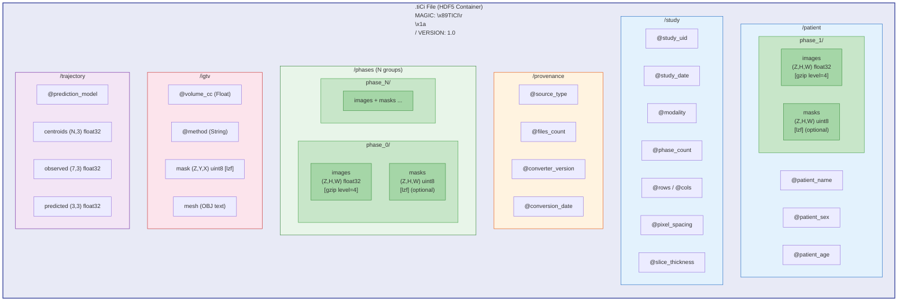
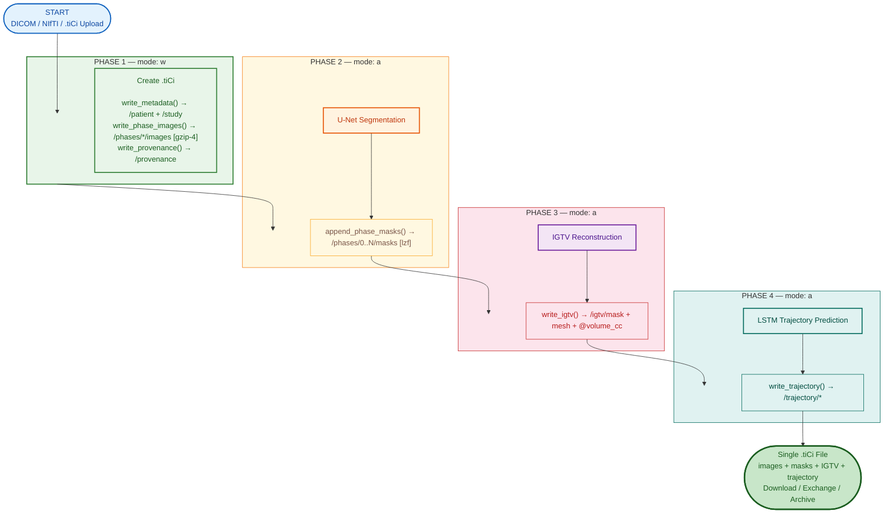

## 图1：.tiCi 格式层次化存储结构示意图

见 `figure1_hierarchy.md`（Mermaid 格式，可在支持 Mermaid 的 Markdown 渲染器中直接查看）

```mermaid
graph TB
    subgraph root[".tiCi File (HDF5 Container)<br/>MAGIC: \x89TICI\r\n\x1a\n / VERSION: 1.0"]
        direction TB
        subgraph patient["/patient"]
            p1["@patient_id"]
            p2["@patient_name"]
            p3["@patient_sex"]
            p4["@patient_age"]
        end
        subgraph study["/study"]
            s1["@study_uid"]
            s2["@study_date"]
            s3["@modality"]
            s4["@phase_count"]
            s5["@rows / @cols"]
            s6["@pixel_spacing"]
            s7["@slice_thickness"]
        end
        subgraph provenance["/provenance"]
            pr1["@source_type"]
            pr2["@files_count"]
            pr3["@converter_version"]
            pr4["@conversion_date"]
        end
        subgraph phases["/phases (N groups)"]
            subgraph p0["phase_0/"]
                p0_img["images<br/>(Z,H,W) float32<br/>[gzip level=4]"]
                p0_msk["masks<br/>(Z,H,W) uint8<br/>[lzf] (optional)"]
            end
            subgraph p1["phase_1/"]
                p1_img["images<br/>(Z,H,W) float32<br/>[gzip level=4]"]
                p1_msk["masks<br/>(Z,H,W) uint8<br/>[lzf] (optional)"]
            end
            subgraph pN["phase_N/"]
                pN_node["images + masks ..."]
            end
        end
        subgraph igtv["/igtv"]
            i1["@volume_cc (Float)"]
            i2["@method (String)"]
            i3["mask (Z,Y,X) uint8 [lzf]"]
            i4["mesh (OBJ text)"]
        end
        subgraph trajectory["/trajectory"]
            t1["@prediction_model"]
            t2["centroids (N,3) float32"]
            t3["observed (7,3) float32"]
            t4["predicted (3,3) float32"]
        end
    end
    style root fill:#E8EAF6,stroke:#283593,stroke-width:2px
    style patient fill:#E3F2FD,stroke:#1565C0
    style study fill:#E3F2FD,stroke:#1565C0
    style provenance fill:#FFF3E0,stroke:#E65100
    style phases fill:#E8F5E9,stroke:#2E7D32
    style p0 fill:#C8E6C9,stroke:#43A047
    style p1 fill:#C8E6C9,stroke:#43A047
    style pN fill:#C8E6C9,stroke:#43A047
    style igtv fill:#FCE4EC,stroke:#C62828
    style trajectory fill:#F3E5F5,stroke:#6A1B9A
    style p0_img fill:#A5D6A7,stroke:#388E3C
    style p0_msk fill:#A5D6A7,stroke:#388E3C
    style p1_img fill:#A5D6A7,stroke:#388E3C
    style p1_msk fill:#A5D6A7,stroke:#388E3C
    style pN_node fill:#A5D6A7,stroke:#388E3C
```

---

## 图2：渐进式管线集成流程图

见 `figure2_pipeline.md`（Mermaid 格式，可在支持 Mermaid 的 Markdown 渲染器中直接查看）

```mermaid
flowchart TD
    START(["START<br/>DICOM / NIfTI / .tiCi Upload"]):::start

    START --> P1_LABEL

    subgraph PHASE1["PHASE 1 — mode: w"]
        direction TB
        P1_LABEL[" "]:::hidden
        P1["Create .tiCi<br/><br/>write_metadata() → /patient + /study<br/>write_phase_images() → /phases/*/images [gzip-4]<br/>write_provenance() → /provenance"]:::phase1
    end

    PHASE1 --> P2_LABEL

    subgraph PHASE2["PHASE 2 — mode: a"]
        direction TB
        P2_LABEL[" "]:::hidden
        P2_SEG["U-Net Segmentation"]:::seg
        P2_SEG --> P2_APPEND["append_phase_masks() → /phases/0..N/masks [lzf]"]:::append1
    end

    P2_APPEND --> P3_LABEL

    subgraph PHASE3["PHASE 3 — mode: a"]
        direction TB
        P3_LABEL[" "]:::hidden
        P3_RECON["IGTV Reconstruction"]:::igtv
        P3_RECON --> P3_APPEND["write_igtv() → /igtv/mask + mesh + @volume_cc"]:::append2
    end

    P3_APPEND --> P4_LABEL

    subgraph PHASE4["PHASE 4 — mode: a"]
        direction TB
        P4_LABEL[" "]:::hidden
        P4_PRED["LSTM Trajectory Prediction"]:::traj
        P4_PRED --> P4_APPEND["write_trajectory() → /trajectory/*"]:::append3
    end

    P4_APPEND --> FINAL

    FINAL(["Single .tiCi File<br/>images + masks + IGTV + trajectory<br/>Download / Exchange / Archive"]):::success

    classDef start fill:#E3F2FD,stroke:#1565C0,stroke-width:2px,color:#0D47A1
    classDef phase1 fill:#E8F5E9,stroke:#2E7D32,stroke-width:2px,color:#1B5E20
    classDef seg fill:#FFF3E0,stroke:#E65100,stroke-width:2px,color:#BF360C
    classDef append1 fill:#FFF8E1,stroke:#F9A825,stroke-width:1px,color:#795548
    classDef igtv fill:#F3E5F5,stroke:#6A1B9A,stroke-width:2px,color:#4A148C
    classDef append2 fill:#FCE4EC,stroke:#C62828,stroke-width:1px,color:#B71C1C
    classDef traj fill:#E0F2F1,stroke:#00695C,stroke-width:2px,color:#004D40
    classDef append3 fill:#E0F2F1,stroke:#00695C,stroke-width:1px,color:#004D40
    classDef success fill:#C8E6C9,stroke:#1B5E20,stroke-width:3px,color:#1B5E20
    classDef hidden fill:none,stroke:none,color:transparent
    style PHASE1 fill:#E8F5E9,stroke:#2E7D32,stroke-width:2px
    style PHASE2 fill:#FFF8E1,stroke:#F57F17
    style PHASE3 fill:#FCE4EC,stroke:#C62828
    style PHASE4 fill:#E0F2F1,stroke:#00695C
```
